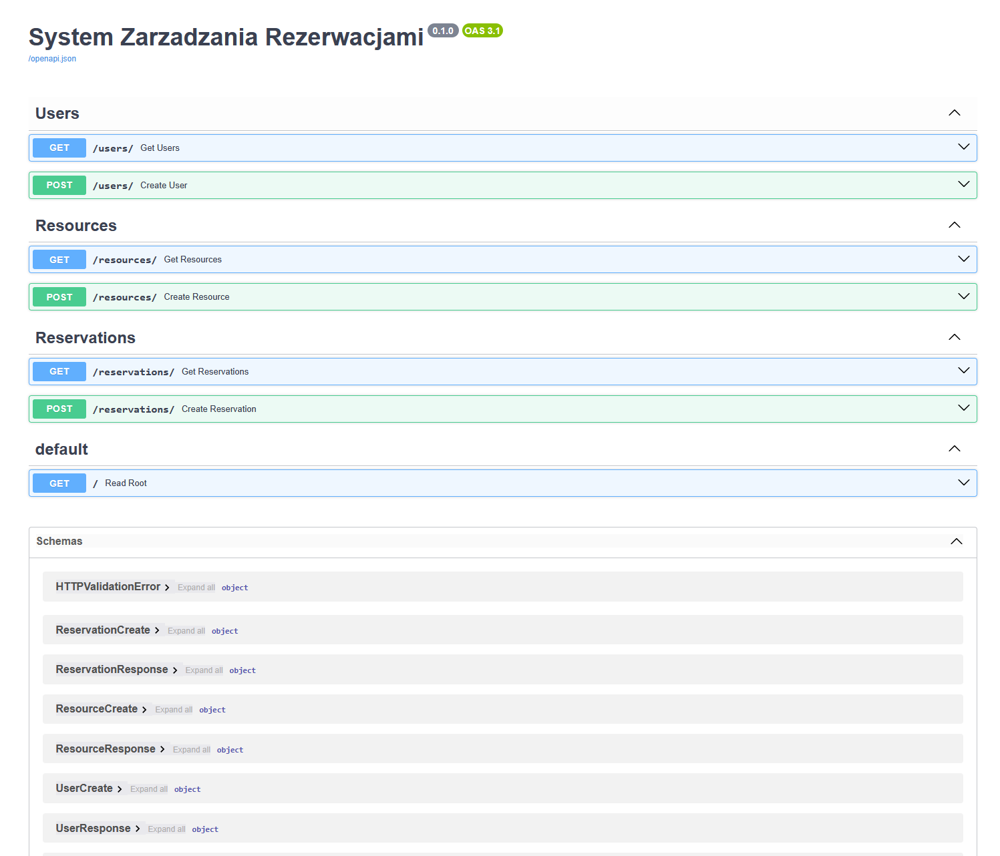
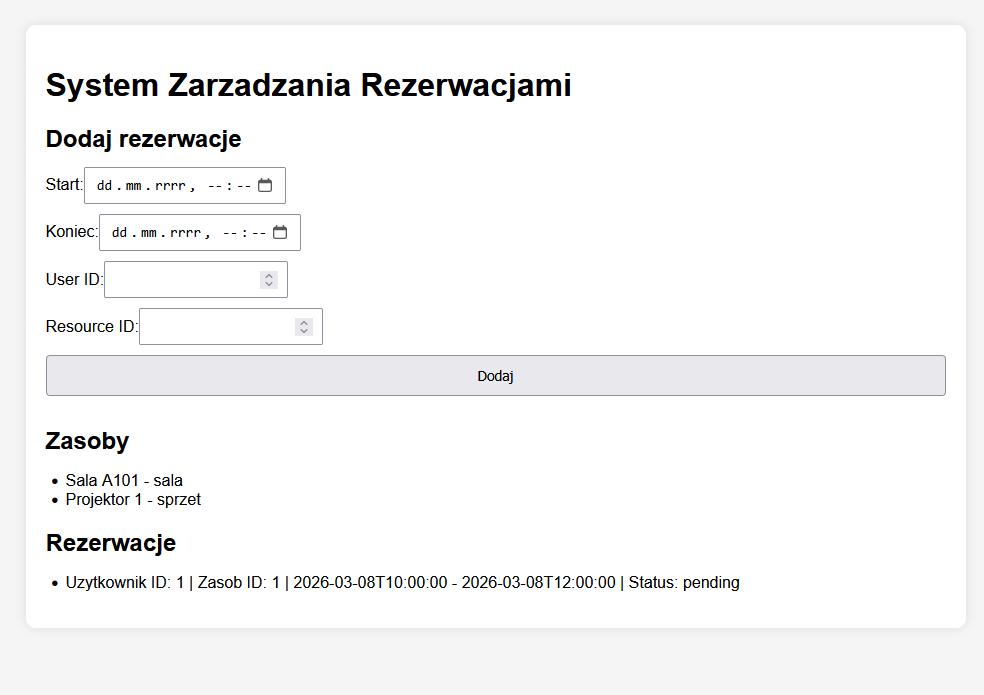
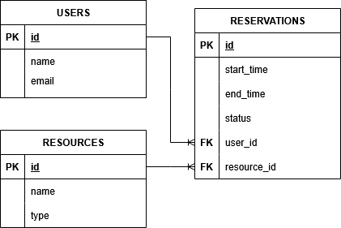
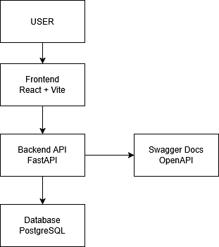

# System Zarządzania Rezerwacjami

Aplikacja webowa umożliwiająca zarządzanie rezerwacjami zasobów takich jak sale konferencyjne lub sprzęt w organizacji.

Projekt powstał jako projekt portfolio pokazujący umiejętności w zakresie:

- tworzenia backendu REST API
- projektowania bazy danych
- implementacji logiki biznesowej
- integracji backendu z frontendem
- dokumentowania systemów informatycznych

---

# Project Status

Aktualnie zaimplementowano:

- backend REST API
- obsługę użytkowników
- obsługę zasobów
- obsługę rezerwacji
- walidację konfliktów terminów
- frontend połączony z backendem
- formularz dodawania rezerwacji

Planowane rozwinięcia projektu:

- role użytkowników (admin / user)
- panel administracyjny
- filtrowanie rezerwacji
- testy API
- moduł rekomendacji zasobów

---

# Funkcjonalności

System umożliwia:

- tworzenie użytkowników
- zarządzanie zasobami (np. sale, sprzęt)
- tworzenie rezerwacji
- przeglądanie listy rezerwacji
- walidację konfliktów rezerwacji (blokowanie nakładających się terminów)

---

# Business Rules

System implementuje następujące reguły biznesowe:

- jeden zasób nie może być zarezerwowany w dwóch nakładających się terminach
- data zakończenia rezerwacji musi być późniejsza niż data rozpoczęcia
- jedna rezerwacja należy do jednego użytkownika
- jedna rezerwacja dotyczy jednego zasobu

---

# Architektura systemu

System składa się z dwóch głównych części.

## Backend

REST API odpowiedzialne za:

- logikę biznesową
- komunikację z bazą danych
- walidację danych
- obsługę rezerwacji

Technologie:

- Python
- FastAPI
- SQLAlchemy
- PostgreSQL

## Frontend

Interfejs użytkownika umożliwiający:

- przeglądanie zasobów
- tworzenie rezerwacji
- przeglądanie historii rezerwacji

Technologie:

- React
- Vite
- Axios

---

# Struktura projektu

```
system-rezerwacji
│
├── backend
│   ├── app
│   │   ├── routers
│   │   ├── models.py
│   │   ├── schemas.py
│   │   ├── crud.py
│   │   ├── database.py
│   │   └── main.py
│
├── frontend
│
├── docs
│
├── tests
│
└── README.md
```

---

# Screenshots

### API Documentation (Swagger)



### Application Interface



---

# Database Diagram



## System Architecture



---

# Uruchomienie projektu

## Backend

Wejdź do katalogu backend:

```
cd backend
```

Aktywuj środowisko wirtualne:

```
venv\Scripts\activate
```

Uruchom serwer:

```
uvicorn app.main:app --reload
```

API będzie dostępne pod adresem:

```
http://127.0.0.1:8000
```

Dokumentacja API (Swagger):

```
http://127.0.0.1:8000/docs
```

---

## Frontend

Wejdź do katalogu frontend:

```
cd frontend
```

Zainstaluj zależności:

```
npm install
```

Uruchom aplikację:

```
npm run dev
```

Frontend będzie dostępny pod adresem:

```
http://localhost:5173
```

---

# Przykładowe endpointy API

### Dodanie użytkownika

```
POST /users/
```

```
{
"name": "Jan",
"email": "jan@example.com"
}
```

---

### Dodanie zasobu

```
POST /resources/
```

```
{
"name": "Sala A101",
"type": "sala"
}
```

---

### Dodanie rezerwacji

```
POST /reservations/
```

```
{
"start_time": "2026-03-08T10:00:00",
"end_time": "2026-03-08T12:00:00",
"user_id": 1,
"resource_id": 1
}
```

---

# Autor

Projekt wykonany jako projekt portfolio programistycznego.